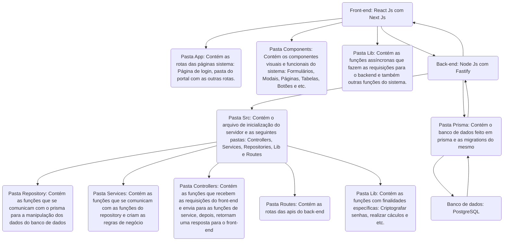

# Oficina de Integração 2 - ELLP: Ensino Lúdico de Lógica e Programação

## Sistema de Cadastro e Geração de Certificados de Alunos Voluntários

Este projeto visa desenvolver um sistema para facilitar o cadastro de alunos voluntários e a emissão de certificados de participação no projeto ELLP. 

## 🤝 Membros do Projeto
- Henrique Galiano de Moraes
- Gustavo Morais Alves
- Gustavo Teodoro do Amaral
- Enrique Marques

## 📈 Fases do Projeto

### ✏️ 1. Planejamento

#### 1.1 Definição de Requisitos Funcionais
- **Autenticação**: O sistema permitirá login com usuário e senha.
- **Alteração de Senha**: O usuário poderá alterar sua senha dentro da aplicação.
- **Cadastro de Alunos**: O sistema permitirá o cadastro dos alunos voluntários do projeto.
- **Gerenciamento de Alunos**: O usuário poderá buscar, editar, excluir ou adicionar novos alunos voluntários.
- **Geração de Certificados**: O sistema permitirá a geração de um certificado de participação em PDF para qualquer aluno selecionado.

#### 1.2 Definição da Arquitetura em Alto Nível do Sistema
- **Camada de Apresentação (Frontend)**: Aplicação web construída com React e Next.js.
- **Camada de Negócios (Backend)**: API RESTful desenvolvida com Node.js e Fastify.
- **Camada de Dados (Banco de Dados)**: PostgreSQL.

#### 1.3 Definição da Estratégia de Automação de Testes
- **Front-end**: Utilização de Jest com mocks para simular chamadas ao backend e testar a interface de usuário.
- **Back-end**: Testes de integração e unitários com o uso de um banco de testes ou mocks de banco de dados, utilizando bibliotecas como Jest e Supertest.

#### 1.4 Tecnologias Utilizadas no Projeto
- **Frontend**: React.js com Next.js.
- **Backend**: Node.js com Fastify e TypeScript.
- **Banco de Dados**: PostgreSQL.

#### 1.5 Arquitetura da aplicação:
- **Usuário**: Representa a interação direta com o sistema, onde o usuário acessa o frontend.
- **Frontend**: Desenvolvido com React e Next.js, responsável pela interface de usuário e pela renderização do conteúdo dinâmico no navegador.
- **Backend**: Implementado em Node.js com Fastify, é o servidor que processa as requisições, gerencia a lógica de negócio e se comunica com o banco de dados.
- **Banco de Dados**: PostgreSQL é utilizado para armazenar dados de forma persistente, acessível pelo backend para operações de leitura e escrita.

#### Diagrama de arquitetura:

#### 1.6 Esboços da aplicação:

  

### 🚀 2. Sprints
#### Sprint 1
- Cadastro de professores (coordenadores do ELLP)
- Cadastro de alunos voluntários
- Login de professores e alunos
- Cadastro de workshops

#### Sprint 2
- Inclusão de alunos voluntários em workshops
- Geração de certificados para os alunos voluntários
- Assinatura dos certificados pelo coordenador
- Busca de certificados para os alunos voluntários
